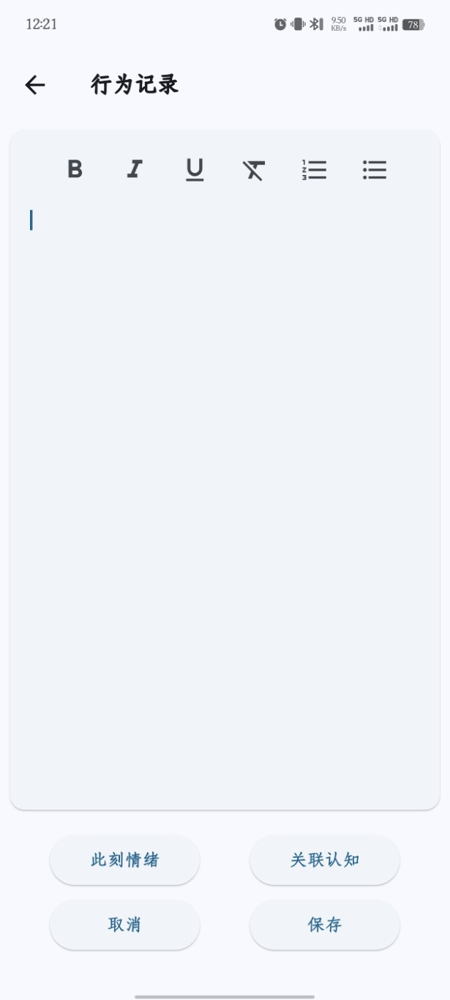
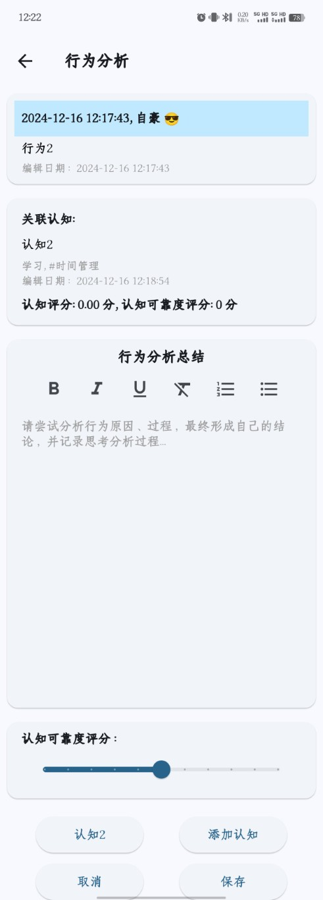

# 行为记录
- 记录是总结反思的基础，日常使用中可以对自己的一些行为进行记录，方便后续的思考和总结。在APP首页“行为”导航栏点击“+”号按钮，可对行为进行记录，界面如下：

- 记录行为时可以选择此时的情绪，比如开心、愤怒、焦虑等情绪。普通的行为记录一般不涉及到“关联认知”，该功能后续会进一步解释。

# 认知总结/挖掘
- 记录行为的目的是为了能够进行反思总结，点击行为的下拉框列表的“分析”按钮，进入行为分析界面，界面如下：

- 对行为进行分析有两个功能：
    1. 认知总结：通过对行为的分析总结经验教训，形成一个认知总结，用于指导后续行为。
    2. 认知挖掘：分析自己行为中隐藏的潜在认知，这个认知通常是自己意识不到的潜意识认知观念，自己平时无法察觉，却深深的影响着我们的行为。挖掘潜意识的认知能够帮我们更好的认识自己，修正不合理的认知。
- 但我们通过行为分析形成了认知后，即可通过“添加认知”按钮记录新的认知，或者分析完后发现这个认知已经存在，那么就可以通过“关联认知”按钮关联已有的认知。

# 认知关联和评分
- 我认为一个行为通过深入的分析和探究后，能形成一个最核心的认知，所以一个行为只能关联一个认知，但是一个认知可以关联多个行为，因为很多行为背后可能都是同一个认知指导的。
- 但是仅仅是通过一个行为分析出来的认知是不可靠的，容易以偏概全，所以每一个行为分析时都可以评估根据这个行为的表现该认知是否可靠，给一个评分，-5分是非常不可靠，5分是非常可靠，默认0分中立，一个认知的评分是所有关联的行为的平均分，通过行为一次次的评分修正，可以不断调整认知的评分，发现更加可靠的总结认知。