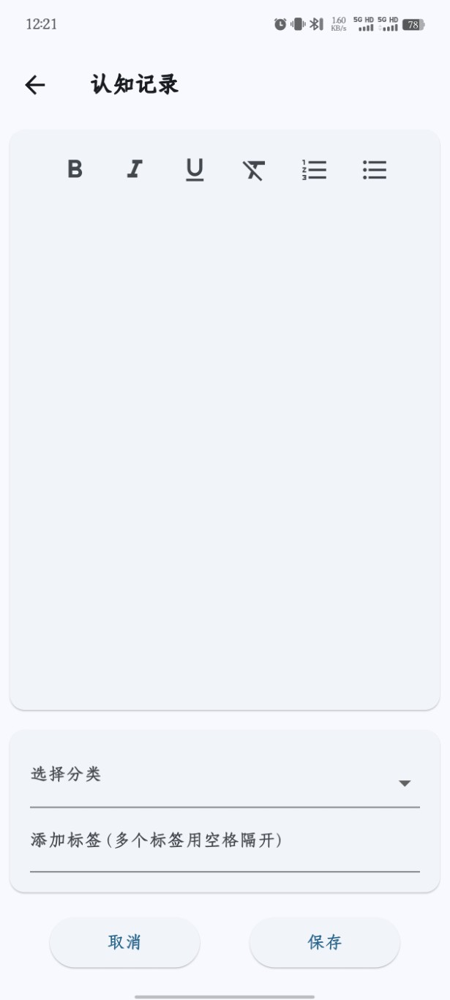
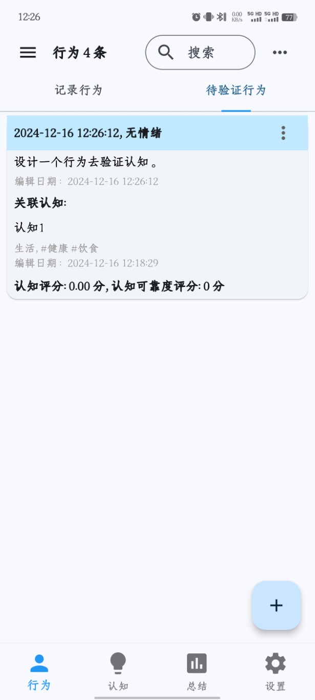

# 认知记录
- 认知指导行为，对认知进行实践能够帮我们内化这个认知成为自己的认知，如果不实践，永远都是“听说过很多道理，却依然过不好这一生”。
- 认知有三个来源：1）行为总结/挖掘形成的认知；2）自己从外部输入学习到的认知，也就是常说的大道理；3）不合理的认知通过反思后，又得到新的合理的认知。不同来源的认知有不同的图标提示。
- 在APP首页“行为”导航栏点击“+”号按钮，可对认知进行记录，这是第二种认知来源，界面如下：

- 记录认知时可以选择自定义分类，比如生活、学习、工作等类别，也可以添加各种标签。

# 认知验证
- 认知不一定可靠，认知验证就是通过自己设计一个具体的行为来验证一个认知是否正确可靠。
- 点击认知列表的“验证”按钮，跳转到行为添加页面，自己设计一个行为去验证该认知，添加的行为会单独趁现在行为列表的“待验证行为”栏目中。

- 等这个行为发生后，通过对行为进行分析反思打分，评估该认知是否可靠，然后点击“已验证”按钮完成此次验证，一个认知可以多次验证评分，因为一个行为不足以判断认知是否可靠有效，需要多次验证评估。