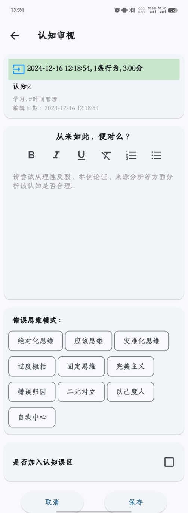

# 认知审视
- 苏格拉底说“未经审视的生活是不值得过的”，鲁迅说“从来如此，便对么？”认知会指导行为，如果是错误的认知，就会产生错误的行为，尤其是哪些我们潜意识里根深蒂固的认知信念。所以我们要对我们的认知进行审视，尤其是通过行[行为总结](1、认知总结.md)发现的潜意识认知观念进行审视，这些潜意识的认知观念会影响我们生活方方面面的行为。
- 在认知列表下拉框中点击“审视”按钮进入认知审视页面，界面如下：

- 认知审视要求我们尝试从理性反驳、举例论证、来源分析等方面来分析该认知是否是合理的，不合理的认知背后通常有错误的认知思维模式，比如绝对化思维、应该思维、灾难思维等等。对于不合理的消极认知，我们可以把它加入到认知误区中替换改进，这就涉及到[认知替换](4、认知替换.md)。