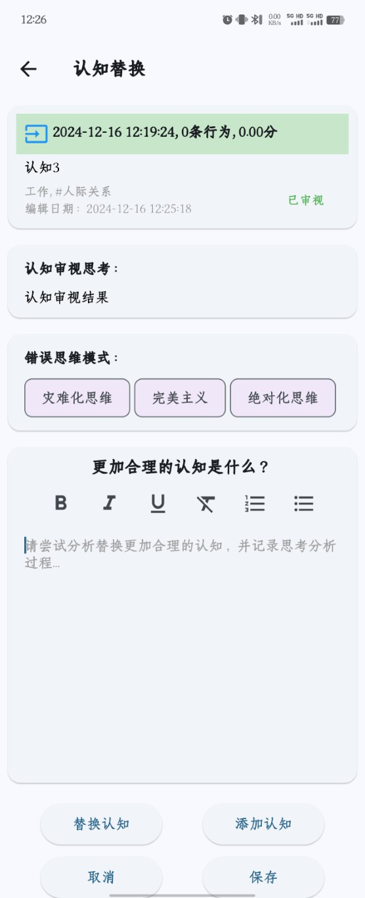

# 认知替换
- 通过[认知审视](3、认知审视.md)步骤，我们发现了一些认知误区，对于这些不合理的认知误区，最好的办法是用更加积极合理的认知去替换掉消极不合理的认知。在“认知误区”页面，点击认知下拉框的“替换”按钮，进入认知替换页面。

- 通过分析思考和学习，将消极不合理的认知替换成积极合理的认知。然后添加新的合理的认知，通过“替换认知”按钮将新的认知替换掉旧的认知。
- 新的认知不一定有效可靠，可以通过[认知验证](2、认知验证.md)来验证，也可以通过[认知审视](3、认知审视.md)再次审视。