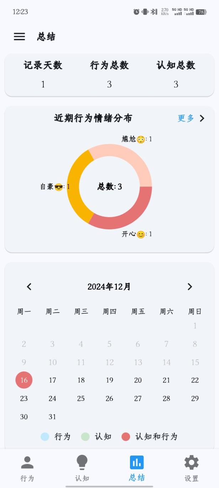
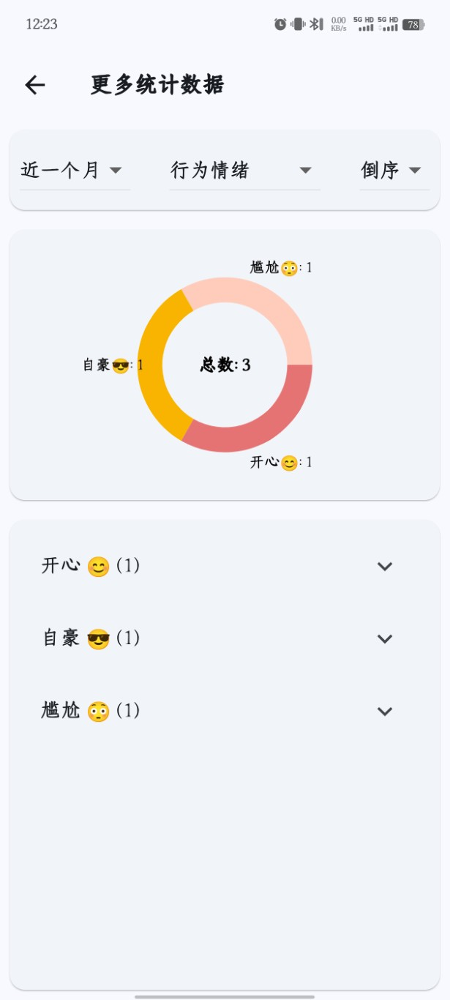

# 统计总结
- 在APP的“总结”导航栏页面中，可以查看到当前记录认知的统计数据。

- 第一部分统计了记录天数、行为总数和认知总数；
- 第二部分展示了近期行为情绪的分布情况，点击“更多”按钮可进入更加详细的统计分类页面。
- 第三部分是日历，标记了记录行为和认知的日期，可以当作简单的打卡工具使用。

# 统计分类
- 点击“更多”按钮，进入统计分类页面。

- 统计分类可以选择时间范围内的行为情绪、认知类别、认知标签、认知思维模式的分类，还能够认知分数、认知关联数进行排序。
- 通过对这些统计数据的查看，能够发现近一段时间内，我记录的认知哪些类比和标签更多，哪些错误的思维模式自己经常犯，哪些认知关联的行为最多，哪些认知的分数高。