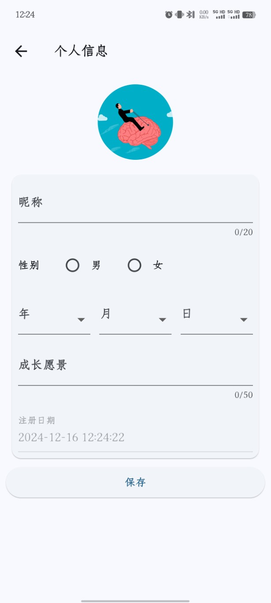

# 设置
- 设置页面功能较少，主要是个人信息设置和数据的备份和恢复，界面如下：

# 个人信息
- 点击设置的个人信息部分，可进入个人信息设置页面，可设置昵称、头像、成长愿景等信息，最重要的是成长愿景的梳理，成长愿景给我们提供一个长远的目标或者榜样，给我们提供源源不断的动力，帮我们成长。

# 备份和恢复
- 该APP所有的数据均存储在本地数据库，不会上传到云端。如果需要更换手机，或者大版本升级无法兼容老版本数据库，请先通过备份功能导出数据库，再通过恢复功能导入数据。